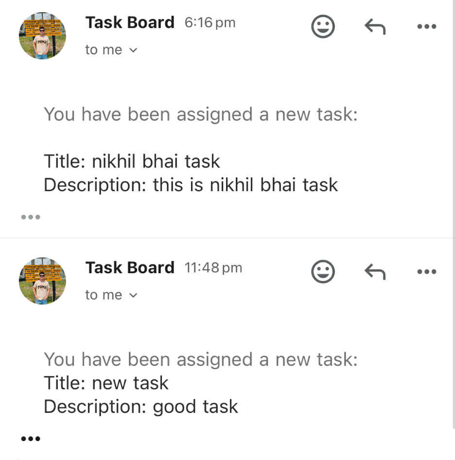
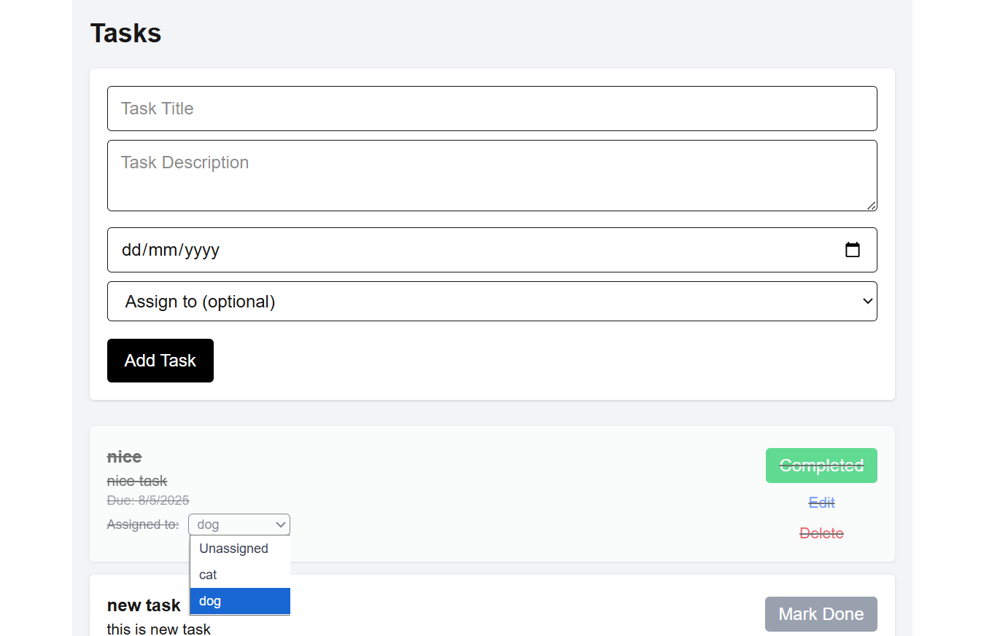

## Collaborative Task Board

A full-stack collaborative task board where users can create and join projects, manage tasks, assign or reassign them, and track progress in real-time.

## Features

- Register new users with avatar upload
- User avatars uploaded using Multer and displayed on the homepage
- Create new projects with custom names
- Join existing projects using a unique project ID
- View all projects you've created or joined on the homepage
- Create & edit tasks with title, description, due date, assignTo
- Tasks are fetched and edited and reassigned in real-time
- Mail sent if the task is assigned or edited or 24 hours is pending.
---

## Tech Stack

###  Frontend

- **Next.js**
- **React**
- **Redux Toolkit**
- **Axios**
- **Formik + Yup**
- **Tailwind CSS**
- **Socket.IO Client**

###  Backend

- **Express.js**
- **MongoDB + Mongoose**
- **Nodemailer**
- **Socket.IO**
- **bcrypt**
- **jsonwebtoken**
- **Multer (for file uploads)**
- **dotenv**
- **cookie-parser**
- **Nodemailer**
- **Node-Cron**

---

## Setup Instructions

1. **Clone the repository**

```bash
git clone https://github.com/Biraj-Thapa/Collaborative-Task-Board
cd collaborative-Task-board
```

---

2. **Setup Backend**

```bash
cd backend
npm i
```

2. **Setup Frontend**

```bash
cd frontend
npm i
```

3. **Setup dotenv inside backend**

```bash
PORT=your_port_here
MONGO_URI=your_mongodb_connection_string
JWT_SECRET=your_jwt_secret
NODE_ENVIRONMENT=development
EMAIL_USER=your_email_id_here
EMAIL_PASS=your_email_password_here
```

4. **Starting Project**

```bash
Frontend= npm run dev
Backend= npm run dev
```

---

## Project Architecture & Design Choices

This is a full-stack web application built using the MERN stack with additional tools for better user experience. On the backend, I used Node.js with Express to handle all API routes, authentication, and for database have used MongoDB. The frontend is built using Next.js, with Redux for managing user authentication state. I chose cookie-based JWT authentication to securely store the token. Axios is used to make API calls from the frontend. The database structure supports users, projects, and tasks with proper relations The goal was to implement realistic features like task assignment, reassignment, editing, and marking complete,real-time updates using Socket.IO and email notifications using Nodemailer. As a fresher, I focused on keeping the architecture simple, clean, and practical for learning and demonstration purposes.

## Screenshots





